# LR6
Лабораторная работа №6


#### Настройка конфига командой git --global. Введены ФИО и email.

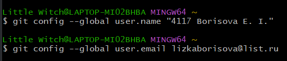

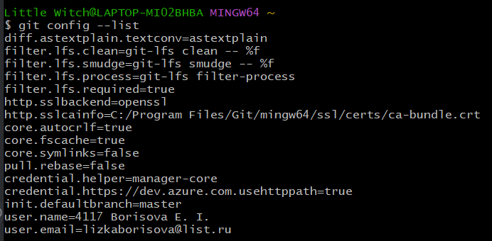

#### Клонирование удаленного репозитория на компьютер.


#### Добавлен файл через интерфейс GitHub, подтянуты изменения в локальный репозиторий.

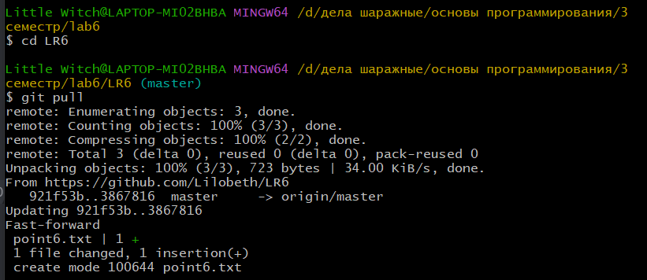

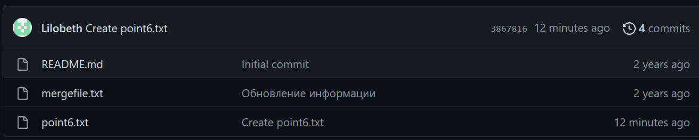

#### Переход на ветку branch1. Вывод ее истории.

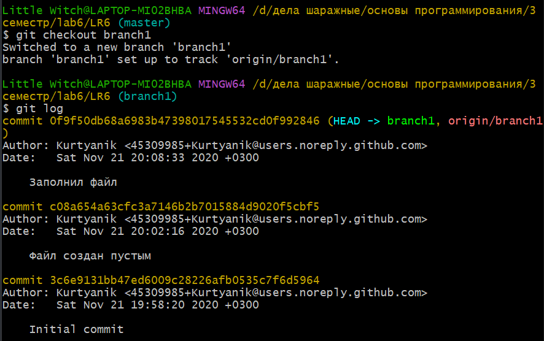

#### История ветки master.

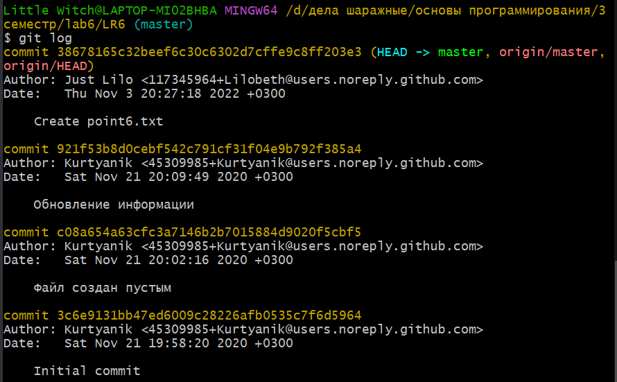

#### Список веток.

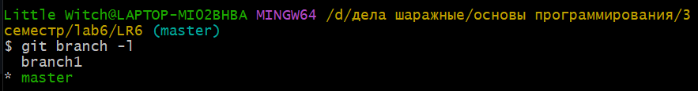

#### Слияние веток branch1 и master. Разрешение конфликта с помощью mergetool.

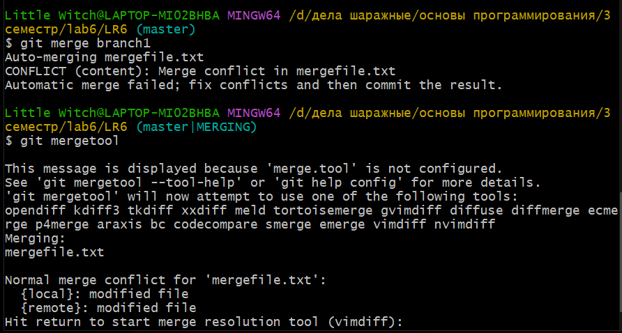 

#### Переход на редактор Vim, команда :diffoff.

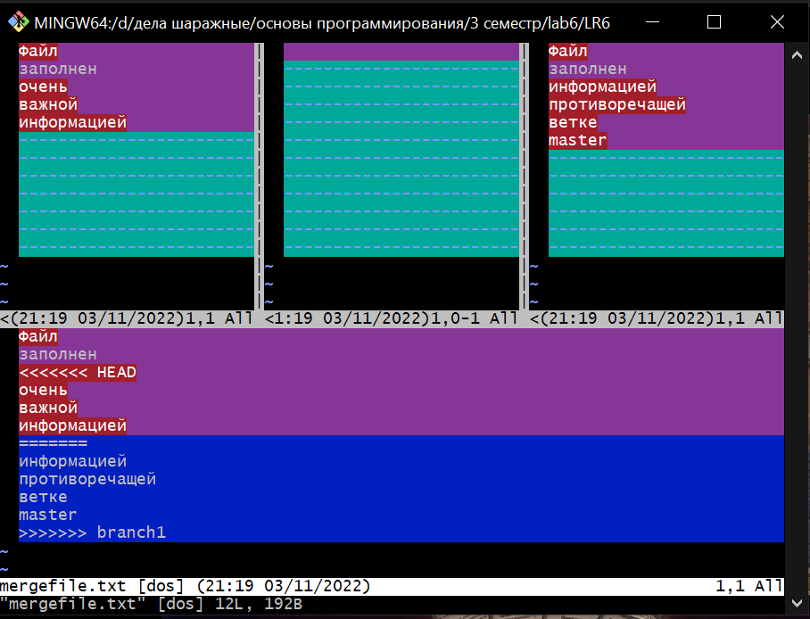

#### Результат работы в Vim. Лишнее удалено при помощи --INSERT--.

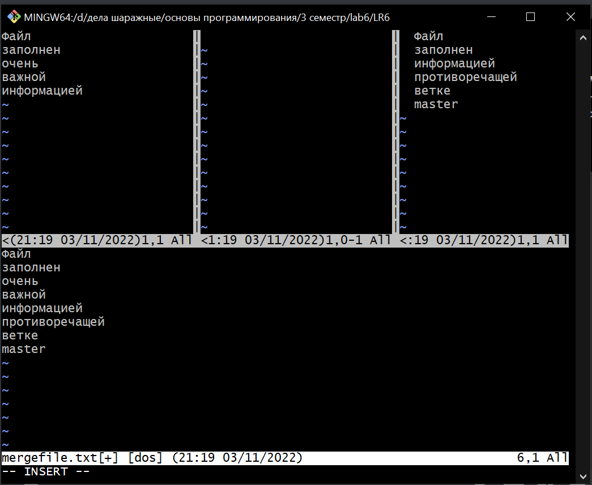

#### Итоговый результат сохранен и добавлен commit.

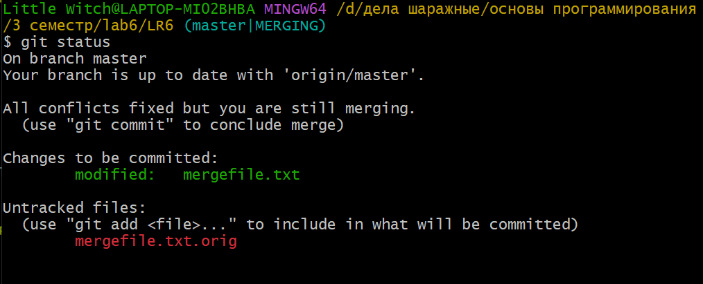

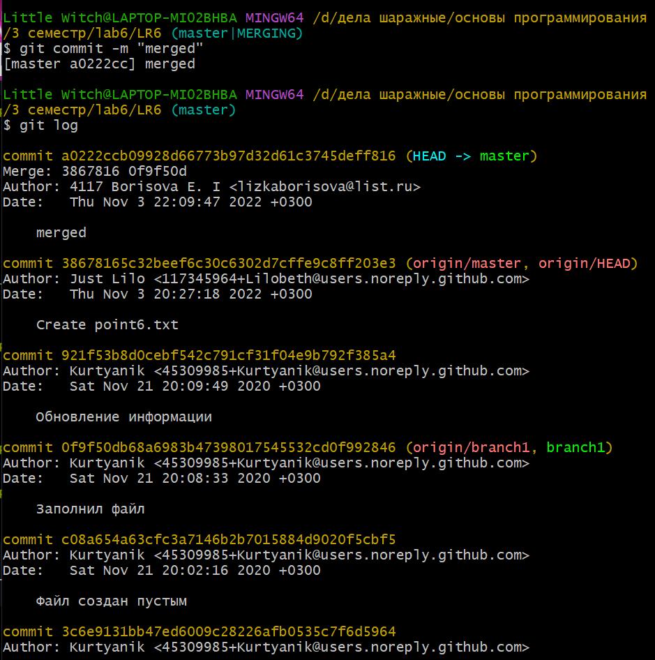

#### Удалена побочная ветка branch1.

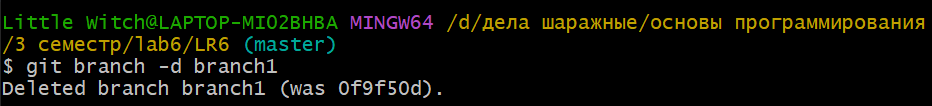

#### Добавление новых файлов. Фиксация изменений в коммите.

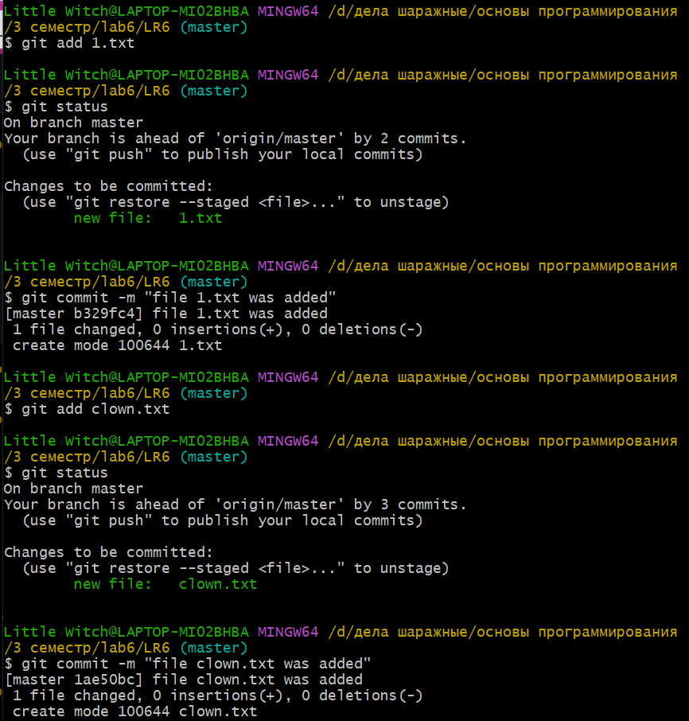

#### Откат коммитов.

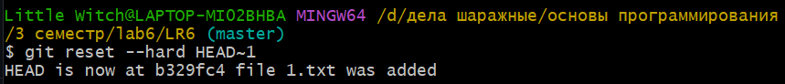

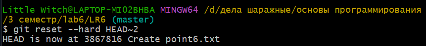

## Создание отчета в README.md
#### Создание ветки для отчета.

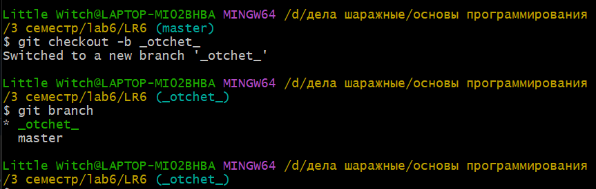

#### Для написания отчета использовался блокнот.

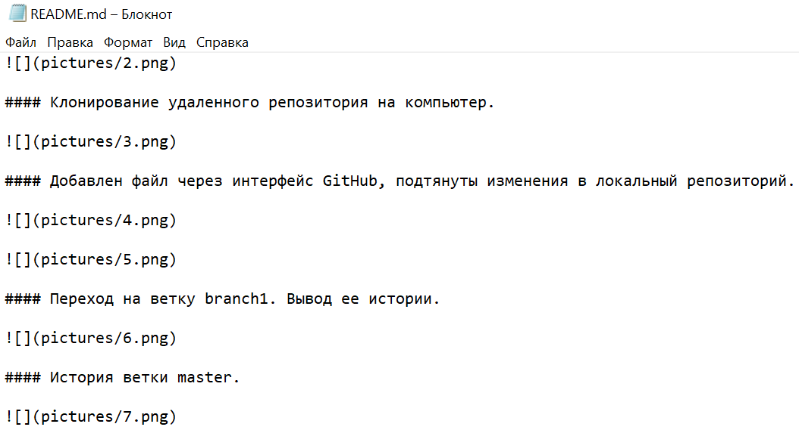

#### История операций в форматированном виде (сокращённый хэш + дата + имя автора + комментарий).

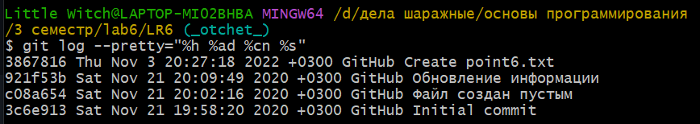

## Лог команд:
```
$ cd d:/'дела шаражные'/'основы программирования'/'3 семестр'/lab6
$ git clone https://github.com/Lilobeth/LR6.git
$ cd LR6
$ git pull
$ git checkout branch1
$ git log
$ git checkout master
$ git branch -l
$ git merge branch1
$ git mergetool
$ git status
$ git add .
$ git rm -f mergefile.txt.orig
$ git commit -m "merged"
$ git branch -d branch1
$ git commit -m "file 1.txt was added"
$ git commit -m "file clown.txt was added"
$ git reset --hard HEAD~1
$ git checkout -b _otchet_
$ git push origin --delete branch1
```
####